# CHARGER PREDICTIVE INTELLIGENCE PLATFORM — DEVELOPMENT FLOW

## 1. Visual Development Progression Flowchart

```mermaid
flowchart TD
    classDef built fill:#1e4620,stroke:#4caf50,stroke-width:2px,color:#fff;
    classDef current fill:#1a365d,stroke:#3182ce,stroke-width:3px,color:#fff;
    classDef next fill:#744210,stroke:#d69e2e,stroke-width:2px,color:#fff;
    classDef planned fill:#2d3748,stroke:#718096,stroke-width:1px,color:#e2e8f0;

    subgraph S1 [FOUNDATION: DATA INTAKE & FIDELITY]
        P1["<b>PHASE 1A: Bronze Ingestion</b><br/><i>Capability:</i> Secure file intake, SHA-256 deduplication, immutable raw storage"]:::built
        P2["<b>PHASE 1B / 2: Schema Intelligence</b><br/><i>Capability:</i> Untrusted header parsing, 456-position mapping, duplicate disambiguation"]:::built
        P3["<b>PHASE 1B / 3: File Profiling</b><br/><i>Capability:</i> Pure-Polars single-pass scan, sampling cadence, duplicate row forensics"]:::built
        P4["<b>PHASE 1C / 4: Data Quality</b><br/><i>Capability:</i> 5-pillar scoring, transport gap detection, fleet coverage reconciliation"]:::built
    end

    subgraph S2 [PHYSICAL CANONICAL RECONSTRUCTION]
        P5["<b>PHASE 1D / 5: Frame Reconstruction</b><br/><i>Capability:</i> Multi-entity row demuxing, dynamic topology resolution, same-second sequencing"]:::built
        P6["<b>PHASE 5.5: Production Contract</b><br/><i>Capability:</i> 456/456 production field verification, hardware sentinel bindings"]:::built
        P7["<b>PHASE 6: Silver Normalization</b><br/><i>Capability:</i> 11 typed domain tables, sentinel masking, atomic field-level provenance"]:::built
    end

    subgraph S3 [LONGITUDINAL CONTINUITY & RESEARCH]
        P8["<b>PHASE 7: Historical Continuity</b><br/><i>Capability:</i> Continuous multi-day timelines, zero-imputation gap detection, counter tracking, subcomponent presence"]:::current
        P9["<b>PHASE 8: Discrete Event Reconstruction</b><br/><i>Capability:</i> Charging session state spans, alarm/fault durations, config transition logs"]:::next
    end

    subgraph S4 [SCIENTIFIC PATTERN & BASELINE INTELLIGENCE]
        P10["<b>PHASE 9: Scientific Pattern Discovery</b><br/><i>Capability:</i> Cross-sectional cohort distributions, thermal drift candidate identification"]:::planned
        P11["<b>PHASE 10: Behavioral Baselines</b><br/><i>Capability:</i> Self-historical, internal module peer, and fleet cohort normative baselines"]:::planned
    end

    subgraph S5 [ANOMALY & PREDICTIVE MAINTENANCE]
        P12["<b>PHASE 11: Multivariate Anomaly Detection</b><br/><i>Capability:</i> Statistical outlier scoring, peer divergence flags, pre-trip transient alerts"]:::planned
        P13["<b>PHASE 12: Failure Ground Truth Linkage</b><br/><i>Capability:</i> Ingest CMMS work orders, component replacements, labeled failure datasets"]:::planned
        P14["<b>PHASE 13: Supervised Predictive Models</b><br/><i>Capability:</i> Breakdown probability, Remaining Useful Life (RUL), SHAP root-cause evidence"]:::planned
        P15["<b>PHASE 14: Maintenance Intelligence Console</b><br/><i>Capability:</i> Priority attention queues, diagnostic worksheets, proactive technician dispatch"]:::planned
    end

    P1 --> P2
    P2 --> P3
    P3 --> P4
    P4 --> P5
    P5 --> P6
    P6 --> P7
    P7 --> P8
    P8 --> P9
    P9 --> P10
    P10 --> P11
    P11 --> P12
    P12 --> P13
    P13 --> P14
    P14 --> P15
```

---

## 2. Capability Unlocked at Each Milestone

| Milestone / Node | State | Core Technical Achievement | Immediate Product Capability Unlocked |
| :--- | :--- | :--- | :--- |
| **Phase 1A: Bronze Ingestion** | `BUILT` | Immutable raw storage & hash deduplication | Reliable file intake, forensic auditability, duplicate rejection |
| **Phase 1B: Schema Intelligence** | `BUILT` | Dictionary registry mapping 456 positions | Untrusted header normalization, duplicate name disambiguation |
| **Phase 1B: File Profiling** | `BUILT` | Single-pass Polars metrics engine | Real sampling cadence, multi-day detection, duplicate row forensics |
| **Phase 1C: Data Quality** | `BUILT` | 5-pillar scoring & fleet reconciliation | Transport quality quantification, missing charger identification |
| **Phase 1D: Frame Reconstruction** | `BUILT` | Topology resolver & same-second sequencer | Coherent physical observation frames from multi-row cartesian CSVs |
| **Phase 5.5: Production Contract** | `BUILT` | 100% field mapping of live commercial fleet | Strict contract alignment for 2,252 commercial fast chargers |
| **Phase 6: Silver Normalization** | `BUILT` | 11 typed domain tables + sentinel masking | Queryable, typed subcomponent telemetry with atomic provenance |
| **Phase 7: Historical Continuity** | `CURRENT` | Cross-file timelines + zero imputation | Longitudinal SMR/gun history, empirical gap detection, counter tracking |
| **Phase 8: Discrete Events** | `NEXT` | Continuous states to discrete event spans | Exact charging session boundaries, alarm event start/end durations |
| **Phase 9: Pattern Discovery** | `PLANNED` | Statistical relationship & trend mining | Identification of pre-failure behavioral signatures across cohorts |
| **Phase 10: Behavioral Baselines** | `PLANNED` | Multi-tier normative behavioral models | Clear mathematical distinction between normal vs drifting operation |
| **Phase 11: Anomaly Detection** | `PLANNED` | Unsupervised multivariate outlier scoring | Early detection of hardware degradation before protection trips |
| **Phase 12: Failure Ground Truth** | `PLANNED` | Integration of CMMS / maintenance tickets | Scientifically validated ground-truth labels for machine learning |
| **Phase 13: Predictive Models** | `PLANNED` | Supervised RUL & failure risk models | Calibrated breakdown probabilities with feature attribution |
| **Phase 14: Maintenance Console** | `PLANNED` | End-to-end field operations dashboard | Actionable servicing recommendations and automated work order dispatch |
