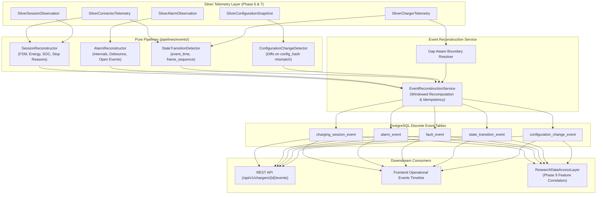

# CHARGER PREDICTIVE INTELLIGENCE PLATFORM
# PHASE 8 — DISCRETE OPERATIONAL EVENT RECONSTRUCTION

## 1. Executive Summary & Purpose

Phase 7 created the historical continuity and multi-day time-series foundation for chargers, physical components, and signals (`charger/component/signal/time`).

Phase 8 elevates raw continuous time-series streams into **deterministic operational events** (`event_type/start/end/duration/context`). Operational events provide the primary semantic units needed for subsequent analytical correlation, pattern mining, and failure prediction (Phases 9+).

### Core Responsibilities
- **Charging Session Reconstruction**: Reconstructs physical vehicle charging sessions per connector, calculating exact boundaries, duration, cumulative energy delivery, starting/ending state of charge (SOC), stop reason, and termination classification.
- **Alarm Interval Aggregation**: Collapses contiguous point-in-time active alarm flags into single duration-bounded alarm events, handling open (unresolved) alarms and configurable debouncing.
- **Hardware Protection Fault Detection**: Identifies critical hardware safety trips (e.g. short circuits, ground faults, over-temperature trips, breaker trips), capturing trip parameters and clearing readings.
- **Operational State Transition Detection**: Reconstructs discrete state change events (`from_state -> to_state`) while strictly preserving order using `(event_time ASC, frame_sequence ASC)`.
- **Configuration Parameter Change Tracking**: Detects exact configuration diffs across consecutive snapshots when `config_hash` changes.
- **Telemetry Gap Awareness & Zero Imputation**: Never guesses, interpolates, or synthesizes event boundaries during telemetry outages; events spanning gaps are explicitly flagged (`has_gap = true`) and assigned lower confidence (`EventConfidence.MEDIUM` / `LOW`).
- **Unified Chronological Operational Timeline**: Serves an integrated chronological stream of all operational events for both REST API consumers and the frontend dashboard.
- **Analytical Join Layer**: Enriches raw asynchronous telemetry observations with active session and alarm context in `ResearchDataAccessLayer.get_telemetry_with_events` for Phase 9 research.

---

## 2. Invariants & Guarantees

1. **Global Temporal Ordering**:
   Event boundaries and sequences are evaluated strictly by `(event_time ASC, frame_sequence ASC)`. Ingestion time and surrogate primary keys are never used for event ordering.
2. **Sub-Second Disambiguation**:
   Multiple frames arriving within the same second are disambiguated by `frame_sequence`, correctly ordering rapid transitions (e.g., `Available -> Preparing -> Charging` within 1 second).
3. **Zero Data Imputation**:
   Missing telemetry is never filled. If an event spans a gap detected by Phase 7, `has_gap = true`, the flag `EVENT_HAS_GAP` is attached, and confidence is reduced.
4. **Out-of-Order & Replay Safety**:
   Windowed recomputation is idempotent. Re-running reconstruction over an interval `[start_time, end_time]` removes previous versioned events and writes fresh, updated events with zero duplicates.
5. **Open Event Semantics**:
   Ongoing alarms, trips, or uncompleted sessions are captured with `is_open = true` and `end_time = None`.
6. **No ML / Predictive Inference**:
   Phase 8 strictly reconstructs past operational facts. No health scores, anomaly scores, remaining useful life (RUL), or failure predictions are made.

---

## 3. Architecture & Data Flow

---

## 4. Database Schema Specification

### 4.1 `charging_session_event`
Stores reconstructed charging sessions per connector.
- `id`: UUID Primary Key
- `charger_id`: String(128), Indexed
- `connector_id`: Integer, Indexed
- `session_id`: String(128), Nullable
- `start_time`: UtcDateTime, Indexed
- `charging_start_time`: UtcDateTime, Nullable
- `charging_end_time`: UtcDateTime, Nullable
- `end_time`: UtcDateTime, Nullable
- `duration_seconds`: Float, Nullable
- `energy_delivered_kwh`: Float, Nullable
- `start_soc`: Float, Nullable
- `end_soc`: Float, Nullable
- `stop_reason`: String(255), Nullable
- `termination_class`: Enum (`NORMAL`, `USER_ABORTED`, `REMOTE_STOPPED`, `SYSTEM_FAULT`, `COMMUNICATION_LOSS`, `UNSPECIFIED`)
- `confidence`: Enum (`HIGH`, `MEDIUM`, `LOW`)
- `has_gap`: Boolean, Indexed
- `quality_flags`: JSONVariant (list of flags)
- `evidence`: JSONVariant
- `reconstruction_version`: String(32), Indexed

### 4.2 `alarm_event`
Stores contiguous alarm intervals.
- `id`: UUID Primary Key
- `charger_id`: String(128), Indexed
- `component_type`: String(64), Indexed
- `component_id`: Integer, Nullable
- `alarm_code`: String(128), Indexed
- `alarm_name`: String(255)
- `severity`: Enum (`INFO`, `MINOR`, `MAJOR`, `CRITICAL`), Indexed
- `start_time`: UtcDateTime, Indexed
- `end_time`: UtcDateTime, Nullable
- `duration_seconds`: Float, Nullable
- `is_open`: Boolean, Indexed
- `start_state`: String(64), Nullable
- `end_state`: String(64), Nullable
- `confidence`: Enum (`HIGH`, `MEDIUM`, `LOW`)
- `has_gap`: Boolean
- `quality_flags`: JSONVariant
- `reconstruction_version`: String(32), Indexed

### 4.3 `fault_event`
Stores critical hardware protection trip spans.
- `id`: UUID Primary Key
- `charger_id`: String(128), Indexed
- `component_type`: String(64), Indexed
- `component_id`: Integer, Nullable
- `fault_code`: String(128), Indexed
- `fault_name`: String(255)
- `start_time`: UtcDateTime, Indexed
- `end_time`: UtcDateTime, Nullable
- `duration_seconds`: Float, Nullable
- `is_open`: Boolean, Indexed
- `initial_reading`: String(128), Nullable
- `clearing_reading`: String(128), Nullable
- `confidence`: Enum (`HIGH`, `MEDIUM`, `LOW`)
- `has_gap`: Boolean
- `quality_flags`: JSONVariant
- `reconstruction_version`: String(32), Indexed

### 4.4 `state_transition_event`
Stores atomic operational status changes.
- `id`: UUID Primary Key
- `charger_id`: String(128), Indexed
- `component_type`: String(64), Indexed
- `component_id`: Integer, Nullable
- `state_field`: String(128), Indexed
- `from_state`: String(128), Nullable
- `to_state`: String(128), Indexed
- `transition_time`: UtcDateTime, Indexed
- `frame_sequence`: Integer

### 4.5 `configuration_change_event`
Stores configuration parameter changes with full JSON diff.
- `id`: UUID Primary Key
- `charger_id`: String(128), Indexed
- `change_time`: UtcDateTime, Indexed
- `old_config_hash`: String(64), Indexed
- `new_config_hash`: String(64), Indexed
- `changed_fields_json`: JSONVariant (key-value diffs)
- `previous_config_json`: JSONVariant, Nullable
- `new_config_json`: JSONVariant, Nullable
- `reconstruction_version`: String(32), Indexed

---

## 5. API Endpoints Reference

| Method | Endpoint | Description | Response Model |
| :--- | :--- | :--- | :--- |
| `POST` | `/api/v1/chargers/{charger_id}/reconstruct-events` | Trigger idempotent event reconstruction over window | `Envelope[EventReconstructionOutcome]` |
| `GET` | `/api/v1/chargers/{charger_id}/event-timeline` | Unified chronological operational stream | `Envelope[EventTimelineResponse]` |
| `GET` | `/api/v1/chargers/{charger_id}/events` | Alias for unified event timeline | `Envelope[EventTimelineResponse]` |
| `GET` | `/api/v1/chargers/{charger_id}/sessions` | Query reconstructed charging sessions | `Envelope[ChargingSessionsResponse]` |
| `GET` | `/api/v1/chargers/{charger_id}/alarms` | Query contiguous alarm intervals | `Envelope[AlarmEventsResponse]` |

---

## 6. Frontend Dashboard Experience

The frontend is extended with the **Operational Events** tab in `frontend/src/pages/ChargerDetail.tsx`:
- **Real-Time Trigger**: "Reconstruct Events" action button with live progress indicator and duration feedback.
- **Operational Metrics Cards**: Session counts, total delivered energy (kWh), active alarms, and timeline events.
- **Filter Controls**: Filter by Event Type (`All`, `Sessions`, `Alarms`, `Faults`, `Config`) and page limit.
- **Visual Status Badges**:
  - Color-coded borders by event category (emerald for sessions, amber for alarms, red for faults, indigo for config).
  - Confidence indicators (`HIGH`, `MEDIUM`, `LOW`).
  - Gap warnings (`⚠️ Crosses Telemetry Gap`).
  - Pulsing status badges for open/active alarms (`ACTIVE OPEN SPAN`).
